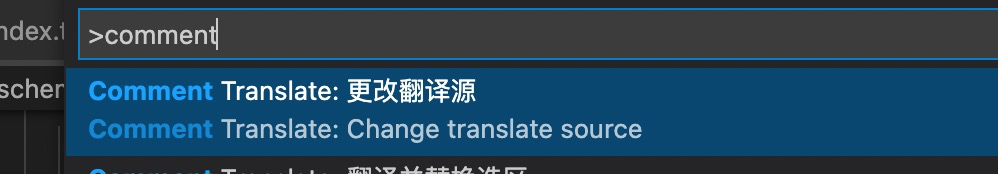
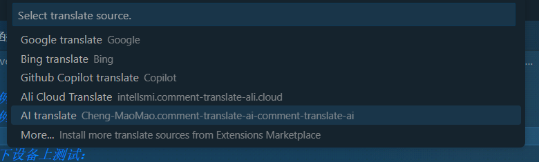

# deepl-translate README

The plugin provides a translation source for the ‘comment-translate’ plugin. Itself does not activate, it starts when enabled is selected.

## Features

1. Provide translation capabilities
2. Provides online document link text

## Requirements

Please install '[comment-translate](https://github.com/intellism/vscode-comment-translate)' to use

## Use
1. After installation, call the "Change translation source" command of "Comment Translate"
    
2. Check "Deepl translate" to configure the plugin API Key
    
3. Directly use the "Comment Translate" interactive mode to translate the corresponding text

## Extension Settings

This extension contributes the following settings:

* `deeplTranslate.apiFree`: Whether it is a free API
* `deeplTranslate.authKey`: set to `authKey` to request
* `deeplTranslate.preserveFormatting`: Sets whether the translation engine should respect the original formatting, even if it would usually correct some aspects. [More](https://www.deepl.com/zh/docs-api/translating-text/request/
* `deeplTranslate.formality`: Sets whether the translated text should lean towards formal or informal language. [More](https://www.deepl.com/zh/docs-api/translating-text/request/)

## Known Issues

Calling out known issues can help limit users opening duplicate issues against your extension.

## Release Notes

Users appreciate release notes as you update your extension.

### 0.0.1

Initialize the project, the basic capabilities are implemented
