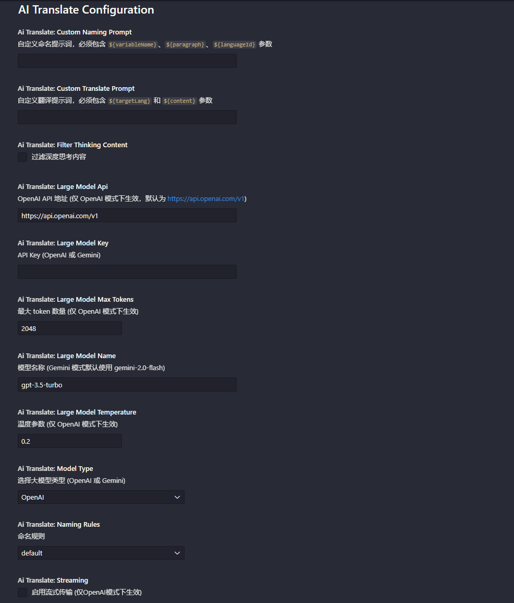

# Comment Translate AI

基于大语言模型的 VSCode 代码注释翻译插件，作为 [Comment Translate](https://github.com/intellism/vscode-comment-translate) 的翻译源扩展。

[简体中文](README.md)

## ✨ 特性

- 🤖 采用OpenAI的API调用规范
- 🎯 专业的编程术语翻译
- ⚡ 快速的翻译响应
- 🛠️ 灵活的配置选项

## 📦 安装

1. 安装 [Comment Translate](https://github.com/intellism/vscode-comment-translate)
2. 安装本插件
3. 在 VS Code 中打开命令面板 (Ctrl+Shift+P)
4. 输入 "Comment Translate: Change translation source"
5. 选择 "AI Translate" 作为翻译源

## ⚙️ 配置

在 VS Code 设置中配置以下选项：

| 配置项                              | 说明                         | 默认值 |
| ----------------------------------- | ---------------------------- | ------ |
| `aiTranslate.largeModelApi`       | 大模型 API 端点              | -      |
| `aiTranslate.largeModelKey`       | API 密钥                     | -      |
| `aiTranslate.largeModelName`      | 模型名称                     | -      |
| `aiTranslate.largeModelMaxTokens` | 最大 token 数（0表示不限制） | 2048   |

## 🚀 快速开始

1. 配置 API 相关信息
   
2. 配置完成后，请调用“Comment Translate”中的“Comment Translate”命令
   
3. 选择翻译源为"AI translate"
   

## 🤝 贡献

欢迎提交 Issue 和 Pull Request！

## 📝 更新日志

### 0.0.1

- 🎉 初始化项目
- ✨ 实现基本翻译功能
- 🔧 添加配置选项

## 🙏 致谢

本项目基于以下优秀的开源项目开发：

- [vscode-comment-translate](https://github.com/intellism/vscode-comment-translate) - VSCode 注释翻译插件
- [deepl-translate](https://github.com/intellism/deepl-translate) - DeepL 翻译扩展，本项目的基础代码来源

特别感谢：

- [@intellism](https://github.com/intellism) 提供的优秀插件框架和参考实现

## 📄 许可证说明

本项目采用 [MIT License](LICENSE) 许可证。

部分代码修改自 [deepl-translate](https://github.com/intellism/deepl-translate)，遵循其 MIT 许可证。
